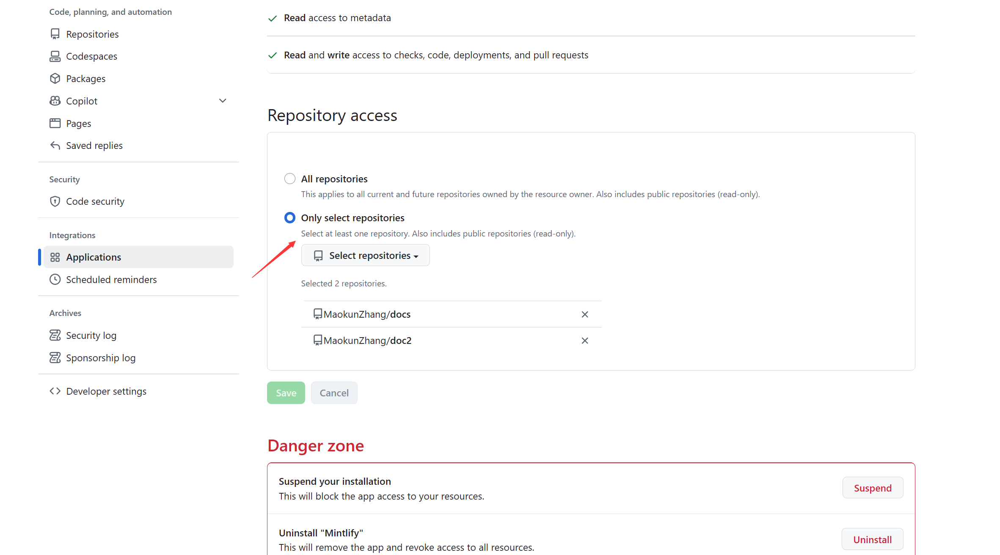
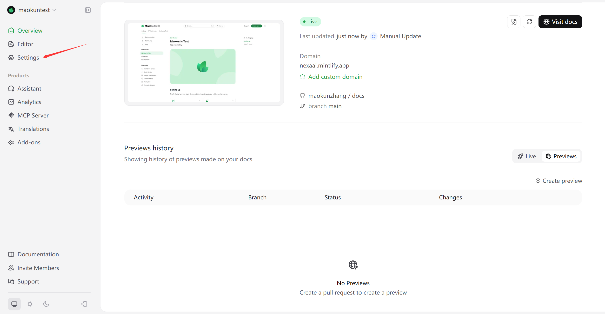
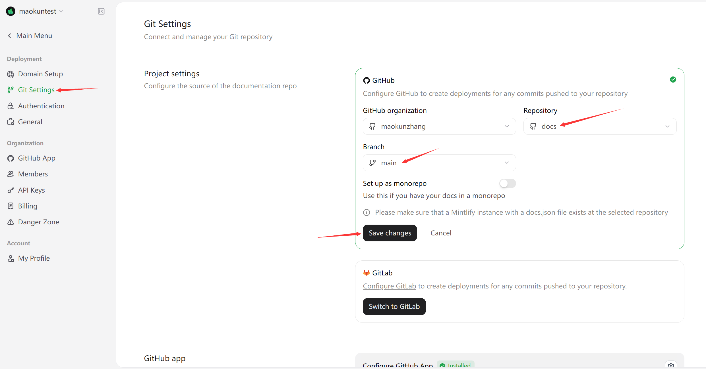
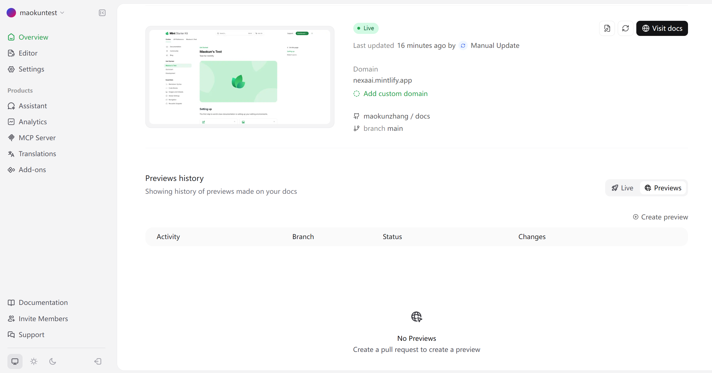

## Prerequisites

Before you begin, make sure you have:

- Node.js (^16.20 || ^18.18 || >=20.17).


## Steps to Install Mintlify

**1.** Install the [CLI](https://www.npmjs.com/package/mint):

```
npm i -g mint
```

**2.** Navigate to the docs directory (where the docs.json file is located) and execute the following command:

```
mint dev
```

Alternatively, if you do not want to install the CLI globally, you can use a run a one-time script:

```
npx mint dev
```

A local preview of your documentation will be available at `http://localhost:3000`.

## Sync the Github repository to the mintlify dashboard

**1.** Installing the GitHub App:

Install the Mintlify GitHub App through your [dashboard](https://dashboard.mintlify.com/settings/organization/github-app).

**2.** Setting Up in GitHub:

Select repositories to authorize.



**3.** Setting Up in Mintlify dashboard:

- Click "Settings" in the dashboard.



- Click on "Git Settings", select Repository and Branch, and finally click "Save changes".



- Now, you can view documentation in the dashboard by clicking "Visit Docs".

